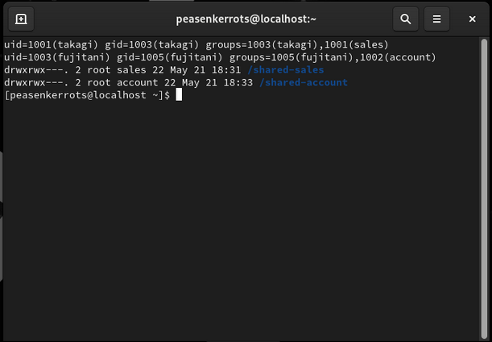
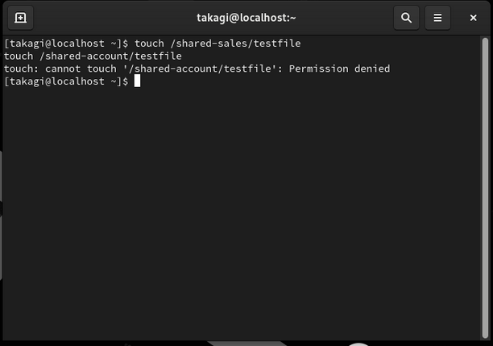
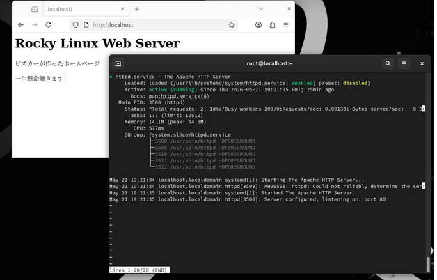
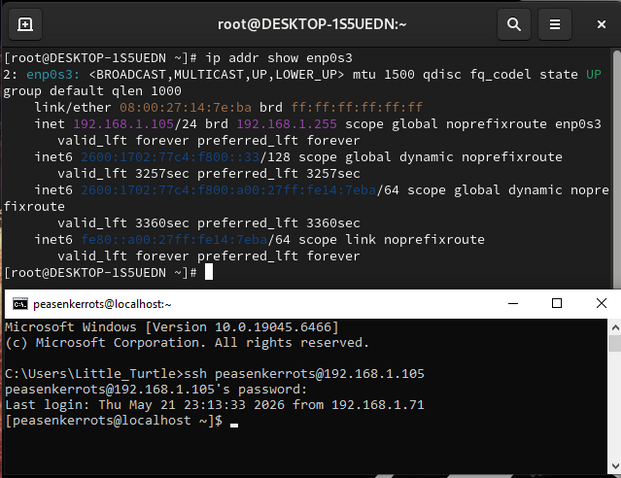
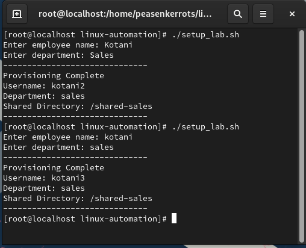
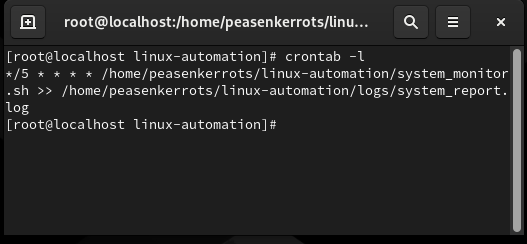

# Linux Infrastructure Lab

Hands-on Linux infrastructure lab featuring server administration, networking, automation, monitoring, and scheduled task management.

---

# Features

- Linux user and group administration
- File permission management
- Apache web server deployment
- Firewall configuration
- Static IP configuration
- SSH remote administration
- Automated user provisioning with Bash scripting
- System monitoring automation
- Cron job scheduling

---

# Technologies Used

- Rocky Linux
- Bash
- Apache (httpd)
- SSH
- systemd / systemctl
- nmcli
- cron / crontab
- Git

---

# User and Group Management

Created Linux users, groups, and shared directories with proper permissions.



---

# Permission Management

Verified restricted access between users and departments.



---

# Apache Web Server

Configured and deployed an Apache web server.



---

# Static IP and SSH Remote Access

Configured a static IP address and successfully connected remotely from a Windows machine using SSH.



---

# Automated User Provisioning Script

Created a Bash automation script that:
- Accepts employee name and department input
- Automatically generates unique usernames
- Dynamically creates department groups
- Assigns users to groups
- Creates shared department directories
- Applies Linux permissions automatically

Example logic:

```bash
while id "$username" &>/dev/null
do
    username="${base_username}${counter}"
    ((counter++))
done
```

---

# System Monitoring Script

Created a Bash monitoring script that reports:
- hostname
- uptime
- memory usage
- disk usage
- IP address
- Apache service status
- SSH service status

Example logic:

```bash
systemctl is-active httpd
systemctl is-active sshd
```

---

# Cron Job Automation

Configured a cron job to automatically execute the monitoring script and append results to a log file every 5 minutes.

```bash
*/5 * * * * /home/peasenkerrots/linux-automation/system_monitor.sh >> /home/peasenkerrots/linux-automation/logs/system_report.log
```

---

# Project Structure

```text
linux-automation/
├── setup_lab.sh
├── system_monitor.sh
├── logs/
├── screenshots/
└── README.md
```
